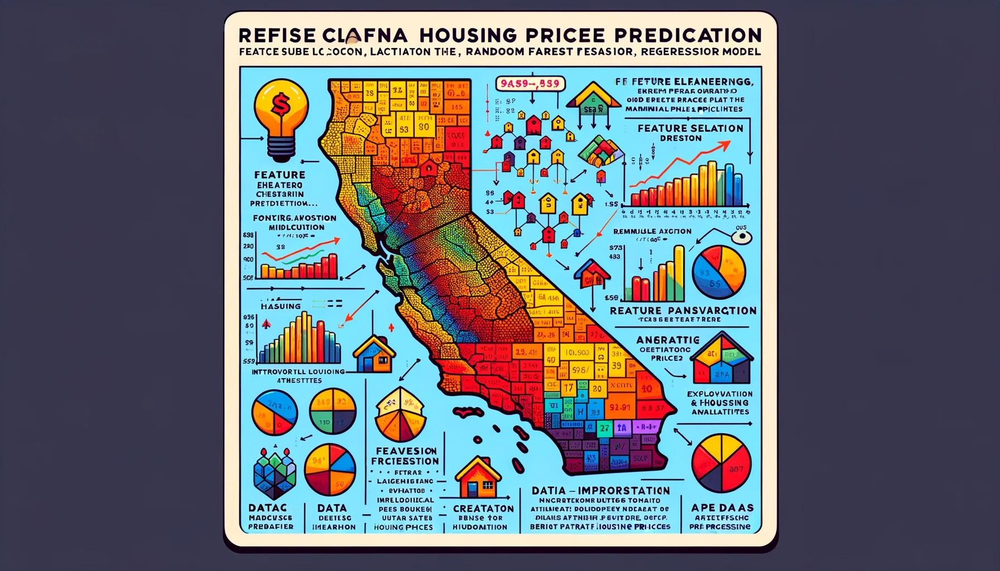

This project comes from "The Complete Pandas Bootcamp 2023 - Data Science with Python", a course offered by Udemy
and taught by Alexander Hagmann. 

The dataset for this project comes from the instructor.

In this project, we are going to predict house prices for districts in California by training and testing an appropriate machine learning model on a dataset containing information on more than 20,000 districts in California. We are going to use the Random Forest Regressor model. 

We plan to visualize California on a map where each point represents a district. The median housing prices in these districts will be illustrated using a color gradient.

We will try to understand why some districts are more expensive than others. We will try to find the most important features that determine house prices, for instance, location or median income.

Finally, we are going to train and test a machine learning model with scikit learn that allows us to predict prices for districts where we don't have any information on house prices.

The primary emphasis will be on:

1. The importation and examination of the dataset to ensure its readiness for analysis.
2. Conducting Explanatory Data Analysis with Pandas and Seaborn to understand the data to select and create appropriate features and select an appropriate model.
3. Undertaking data pre-processing and feature engineering using Pandas to prepare the data for modeling.

While integrating these steps into a scikit-learn pre-processing pipeline is common for ongoing machine learning operations, for a one-off project like ours, employing straightforward Pandas code for data manipulation and preparation is equally effective. 

[View the Jupyter Notebook](https://github.com/Pacode74/CA-HousePrice-Predictor/blob/main/MachineLearning_Predict_House_Prices.ipynb)

[View in nbviewer](https://nbviewer.jupyter.org/github/Pacode74/CA-HousePrice-Predictor/blob/main/MachineLearning_Predict_House_Prices.ipynb)

# Data Preprocessing & Feature Engineering for Machine Learning - Predicting House Prices in California

## Contents
- [(1) Project Introduction](#1-project-introduction)
- [(2) Data Import and Inspection](#2-data-import-and-inspection)
  - [(2.1) Initial Overview and Some Cleaning Recommendations](#21-initial-overview-and-some-cleaning-recommendations)
- [(3) Data Cleaning](#3-data-cleaning)
  - [(3.1) Dropping Missing Values](#31-dropping-missing-values)
  - [(3.2) Evaluating the Impact of Capped Values](#32-evaluating-the-impact-of-capped-values)
- [(4) Feature Engineering - Part 1](#4-feature-engineering---part-1)
  - [(4.1) Number of Rooms per Household](#41-number-of-rooms-per-household)
  - [(4.2) Population per Household](#42-population-per-household)
  - [(4.3) Bedrooms per Room](#43-bedrooms-per-room)
  - [(4.4) Recommendations for Dealing with Outliers](#44-recommendations-for-dealing-with-outliers)
  - [(4.5) Discretization and Binning of Median Income](#45-discretization-and-binning-of-median-income)
- [(5) Exploratory Data Analysis](#5-exploratory-data-analysis)
  - [(5.1) Ocean Proximity and House Values](#51-ocean-proximity-and-house-values)
  - [(5.2) Correlation Analysis](#52-correlation-analysis)
  - [(5.3) Median Income and House Value](#53-median-income-and-house-value)
  - [(5.4) Non-linear Relationships Between Location and Prices](#54-non-linear-relationships-between-location-and-prices)
  - [(5.5) Explore "ocean_proximity" and "median_house_value" relationship using barplot](#55-explore-ocean-proximity-and-median-house-value)
  - [(5.6) Explore "income_cat" and "ocean_proximity" relationship using heatmap](#56-explore-income-cat-and-ocean-proximity)
- [(6) Preprocessing for Machine Learning - Part 2](#6-preprocessing-for-machine-learning---part-2)
  - [(6.1) Separating Features and Labels](#61-separating-features-and-labels)
  - [(6.2) Feature Scaling](#62-feature-scaling)
  - [(6.3) Categorical Data Encoding](#63-categorical-data-encoding)
  - [(6.4) Balancing Preprocessing Tools](#64-balancing-preprocessing-tools)
- [(7) Splitting the Data into Train and Test Sets](#7-splitting-the-data-into-train-and-test-sets)
  - [(7.1) Importance of Train/Test Split](#71-importance-of-train-test-split)
- [(8) Training the ML Model (Random Forest Regressor)](#8-training-the-ml-model-random-forest-regressor)
  - [(8.1) Criteria for Using Random Forest Regressor](#81-criteria-for-using-random-forest-regressor)
  - [(8.2) Training Process](#82-training-process)
- [(9) Testing/Evaluating the Model on the Test Set](#9-testingevaluating-the-model-on-the-test-set)
  - [(9.1) Calculating RMSE on the Test Set](#91-calculating-rmse-on-the-test-set)
  - [(9.2) Mean Absolute Error Analysis](#92-mean-absolute-error-analysis)
- [(10) Feature Importance](#10-feature-importance)
  - [(10.1) Obtaining Feature Importances](#101-obtaining-feature-importances)
  - [(10.2) Creating a Series for Feature Importances](#102-creating-a-series-for-feature-importances)
  - [(10.3) Visualizing Feature Importances](#103-visualizing-feature-importances)
  - [(10.4) Interpreting Feature Importance](#104-interpreting-feature-importance)

